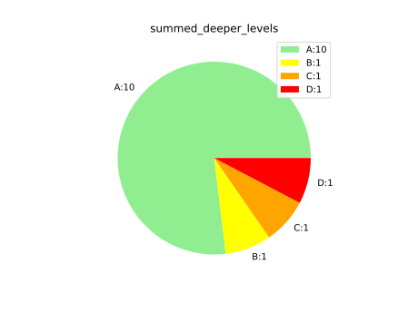

# radon tool

recurisve graphical tool for https://pypi.org/project/radon/

install with

`python3 setup.py install --user`

use with

`recursive_radon_tool`

output:

A nested folder structure that replicates your project.

output.htmls that describe the folder of your project.

piechart.svgs that display the cyclometric complexity of scripts in the folder
as well as the sum of "deeper" levels.

like this:

# other notes

You can reuse this and plug in your own code analysis.

This project recrusively goes through a project and recreates the structure
and gives an option to render "data".

In fact I will probably extends this to do that for more metrics than
just cyclometric complexity.

# inspiration

codecov creates it's output as a browsable local html collection, I thought
that was pretty smart.
